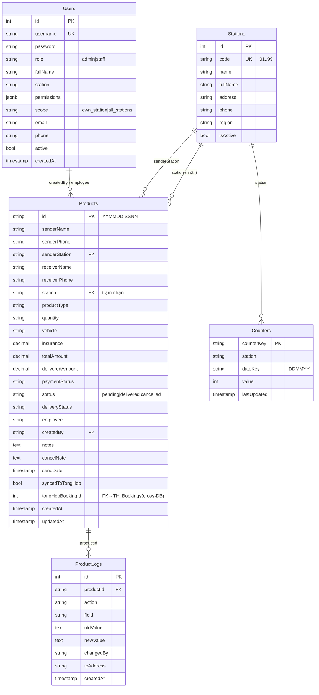
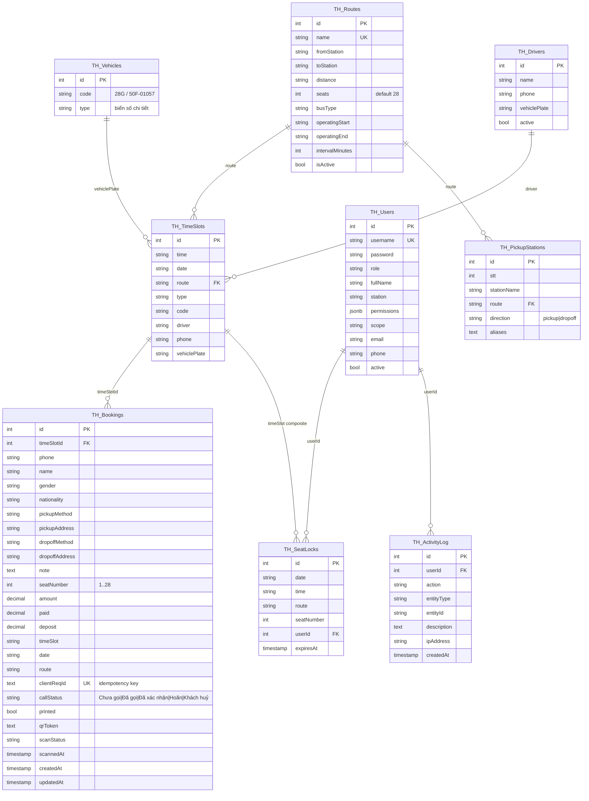
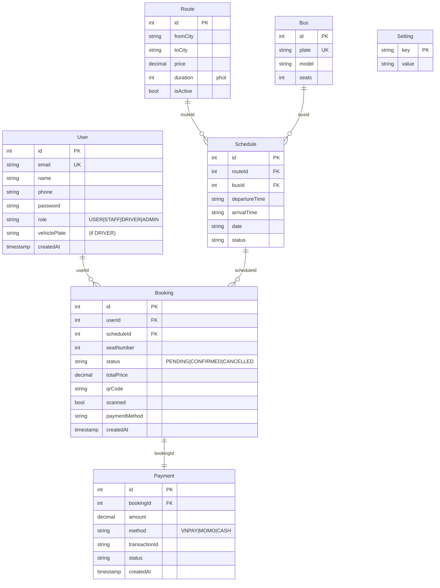
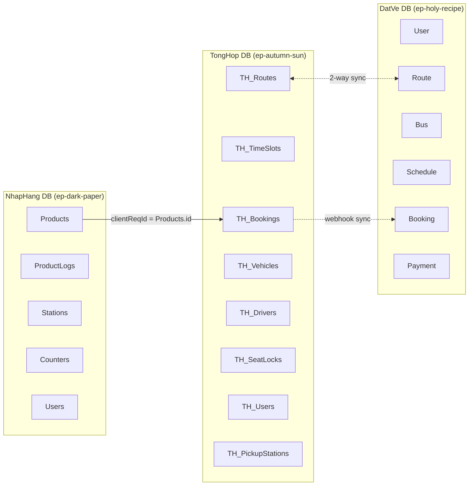

# Sơ đồ ERD — Hệ thống Võ Cúc Phương

Sơ đồ dùng cú pháp **Mermaid** — paste vào https://mermaid.live để xuất PNG / SVG, hoặc xem trực tiếp trên GitHub.

---

## 1. ERD NhapHang DB

---

## 2. ERD TongHop DB

---

## 3. ERD DatVe DB (Đặt vé online cho khách)

---

## 4. Sơ đồ tổng thể 3 CSDL

