# Mô hình Use Case — Hệ thống Võ Cúc Phương

## 1. Các Actor

| Actor | Mô tả | Module truy cập |
|---|---|---|
| **Khách hàng** | Người mua vé / gửi hàng | App `VCP Đặt Vé`, web `vocucphuong.vercel.app` |
| **Nhân viên quầy** | NV bán vé tại bến | App `VCP Nội Bộ` → tab Tổng Hợp, web TongHop |
| **Nhân viên kho** | NV nhận/giao hàng hoá | App nội bộ → tab Nhập Hàng, web NhapHang |
| **Tài xế** | Lái xe khách | App nội bộ + giao diện `/driver` quét QR vé |
| **Quản trị viên** | Admin toàn hệ thống | Tất cả modules + trang `/users`, `/audit` |

---

## 2. Use Case Diagram tổng

```mermaid
flowchart TB
    Khach((Khách hàng))
    NVQuay((NV Quầy))
    NVKho((NV Kho))
    TaiXe((Tài xế))
    Admin((Quản trị))

    subgraph DatVeOnline["Đặt vé online"]
        UC1[Tra cứu chuyến]
        UC2[Đặt vé online]
        UC3[Thanh toán VNPay/MoMo]
        UC4[Nhận QR code]
        UC5[Xem lịch sử vé]
    end

    subgraph TongHop["Quản lý vé tại quầy"]
        UC10[Tạo vé thủ công]
        UC11[Chọn ghế trên sơ đồ]
        UC12[In vé QR]
        UC13[Gọi xác nhận khách]
        UC14[Đổi/huỷ vé]
        UC15[Tìm khách toàn hệ thống]
        UC16[Xuất CSV / Báo cáo]
    end

    subgraph NhapHangUC["Quản lý hàng hoá"]
        UC20[Nhận hàng / tạo đơn]
        UC21[Sinh mã đơn YYMMDD.SSNN]
        UC22[Giao hàng tại đích]
        UC23[Hủy đơn / ghi chú]
        UC24[Xem thống kê doanh thu]
        UC25[Audit log thay đổi]
    end

    subgraph TaiXeUC["Tài xế"]
        UC30[Quét QR check-in vé]
        UC31[Hoàn thành chuyến]
        UC32[Chọn biển số xe đang chạy]
    end

    subgraph AdminUC["Quản trị"]
        UC40[Quản lý user + phân quyền]
        UC41[Cấu hình tuyến + giờ chạy]
        UC42[Quản lý điểm đón / trả]
        UC43[Tắt/bật đặt vé online]
        UC44[Xem báo cáo cuối ngày]
    end

    Khach --> UC1
    Khach --> UC2
    Khach --> UC3
    Khach --> UC4
    Khach --> UC5

    NVQuay --> UC10
    NVQuay --> UC11
    NVQuay --> UC12
    NVQuay --> UC13
    NVQuay --> UC14
    NVQuay --> UC15
    NVQuay --> UC16

    NVKho --> UC20
    NVKho --> UC21
    NVKho --> UC22
    NVKho --> UC23
    NVKho --> UC24

    TaiXe --> UC30
    TaiXe --> UC31
    TaiXe --> UC32

    Admin --> UC40
    Admin --> UC41
    Admin --> UC42
    Admin --> UC43
    Admin --> UC44
    Admin --> UC25

    UC20 -.->|"extend (Dọc đường → booking xe)"| UC10
```

---

## 3. Mô tả chi tiết use case chính

### UC2 — Khách đặt vé online

| Mục | Nội dung |
|---|---|
| Actor chính | Khách hàng |
| Tiền điều kiện | Khách mở app/web, hệ thống bật đặt vé online (`Setting.booking_enabled = true`) |
| Luồng chính | 1. Khách chọn tuyến, ngày 2. Hệ thống hiển thị danh sách chuyến (`Schedule`) 3. Khách chọn chuyến → mở sơ đồ ghế 4. Hệ thống tạo `TH_SeatLocks` lock ghế 10 phút 5. Khách điền tên + SĐT + chọn phương thức thanh toán 6. Nếu VNPay/MoMo: redirect cổng → callback → `Payment.status = 'SUCCESS'` 7. Tạo `Booking` + gửi QR qua SMS/Email |
| Luồng phụ | - Hết 10 phút mà chưa thanh toán → release ghế - Thanh toán fail → giữ lock cho khách thử lại trong TTL còn lại |
| Hậu điều kiện | `Booking.status = CONFIRMED`, `qrCode` gửi cho khách |

### UC10 — NV quầy tạo vé thủ công

| Mục | Nội dung |
|---|---|
| Actor chính | Nhân viên quầy |
| Tiền điều kiện | NV đã login, có quyền `phongve.create` |
| Luồng chính | 1. Chọn tuyến + ngày + chuyến từ danh sách `TH_TimeSlots` 2. SeatMap hiện 28 ô ghế, ghế đã đặt màu xám, ghế đang lock màu vàng 3. Click ghế trống → mở form `PassengerFormNew` 4. NV nhập tên / SĐT / điểm đón / điểm trả / số tiền 5. Auto-detect điểm trả từ note (vd. "30/4" → "Bưu điện Trảng Bom") 6. Lưu → tạo `TH_Bookings` |
| Luồng phụ | - Ghế đã bị NV khác lock → toast "Ghế đang được chọn bởi NV khác" - SĐT đã từng đặt → autocomplete suggest tên |
| Hậu điều kiện | Booking lưu, broadcast multi-tab qua BroadcastChannel để các tab khác refresh |

### UC20 — NV kho nhận hàng

| Mục | Nội dung |
|---|---|
| Actor chính | Nhân viên kho |
| Luồng chính | 1. NV nhập trạm gửi (mặc định = trạm hiện tại của NV) 2. Chọn trạm nhận từ dropdown (`Stations`) 3. Server query `Counters` (atomic upsert) → sinh mã `YYMMDD.SSNN` (SS = mã trạm nhận) 4. NV điền người gửi, người nhận, loại hàng, tiền cước 5. POST `/api/nhap-hang/products` → tạo `Products` 6. **Nếu trạm nhận = "Dọc đường"** → fire-and-forget gọi `createTongHopBooking()` tạo `TH_Bookings` (xe sẽ thả khách dọc đường) |
| Hậu điều kiện | Response 201 với mã đơn → in biên lai 92mm |

### UC30 — Tài xế quét QR check-in vé

| Mục | Nội dung |
|---|---|
| Actor chính | Tài xế |
| Tiền điều kiện | Đã chọn biển số xe trong session (`User.vehiclePlate`) |
| Luồng chính | 1. Mở app → trang `/driver` → bật camera 2. Quét QR vé khách → web đọc `qrToken` → GET `/api/scan/{token}` 3. Hệ thống verify token, check trùng route + ngày 4. Update `TH_Bookings.scanStatus = scanned`, `scannedAt = NOW()` 5. Hiển thị tên + ghế + tổng tiền → tài xế bấm "Đã thu" / "Đã thanh toán online" |
| Luồng phụ | - QR đã quét → cảnh báo "Vé đã được sử dụng" - QR sai chuyến → cảnh báo "Chuyến khác" |
| Hậu điều kiện | Hết chuyến tài xế bấm "Hoàn thành chuyến" → tổng kết tiền |

### UC40 — Admin phân quyền

| Mục | Nội dung |
|---|---|
| Actor chính | Admin (role=`admin`) |
| Luồng chính | 1. Vào trang `/users` 2. Click user → mở form chỉnh sửa 3. Tick các permission keys (15 keys: `phongve.view`, `phongve.create`, `phongve.edit`, `phongve.cancel`, `kho.view`, `kho.edit`, `thongke.view`, `logs.view`, `users.manage`, ...) 4. Chọn `scope`: `own_station` (chỉ trạm gắn) hoặc `all_stations` 5. Lưu → JSONB column `permissions` cập nhật 6. JWT lần login tới sẽ carry permissions mới |

---

## 4. Ma trận phân quyền (Authorization matrix)

| Permission | Admin | NV Quầy | NV Kho | Tài xế | Khách |
|---|:---:|:---:|:---:|:---:|:---:|
| `phongve.view` | ✓ | ✓ | | | |
| `phongve.create` | ✓ | ✓ | | | |
| `phongve.edit` | ✓ | ✓ | | | |
| `phongve.cancel` | ✓ | only own | | | |
| `kho.view` | ✓ | | ✓ | | |
| `kho.edit` | ✓ | | ✓ | | |
| `thongke.view` | ✓ | ✓ | ✓ | | |
| `logs.view` | ✓ | | | | |
| `users.manage` | ✓ | | | | |
| Quét QR vé | ✓ | ✓ | | ✓ | |
| Đặt vé online | ✓ | ✓ | | | ✓ |
| Xem lịch sử vé cá nhân | | | | | ✓ |
