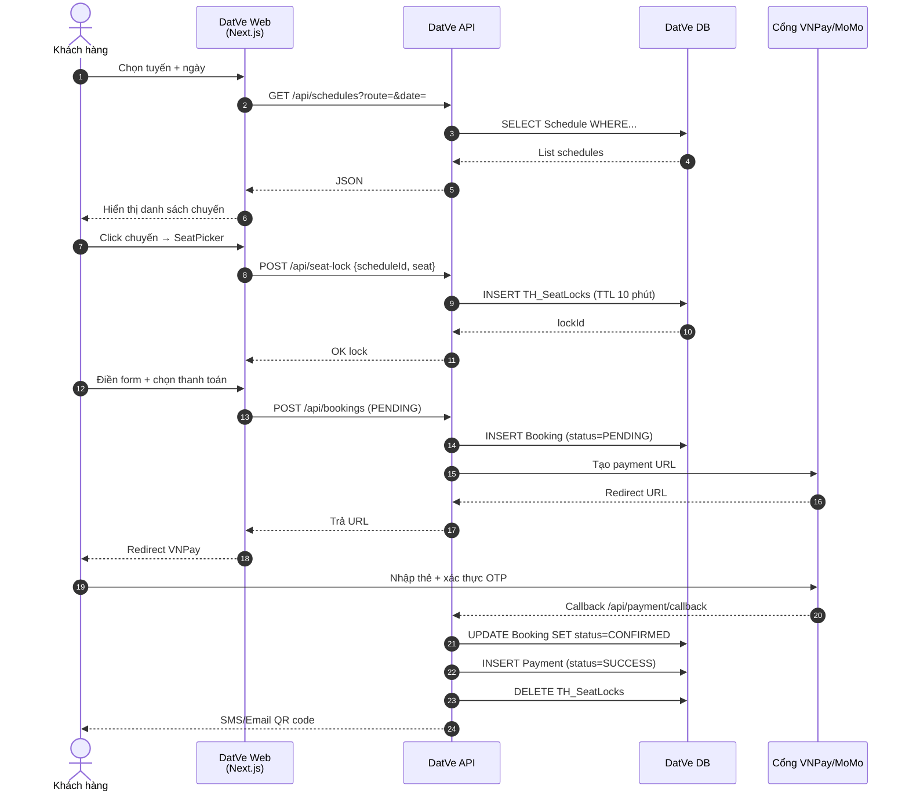
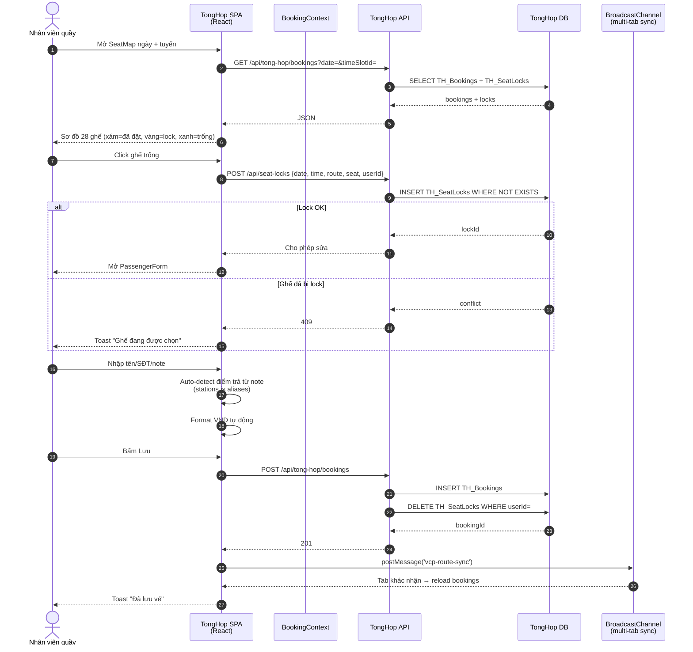
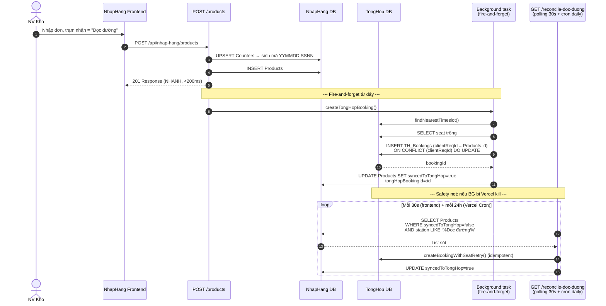
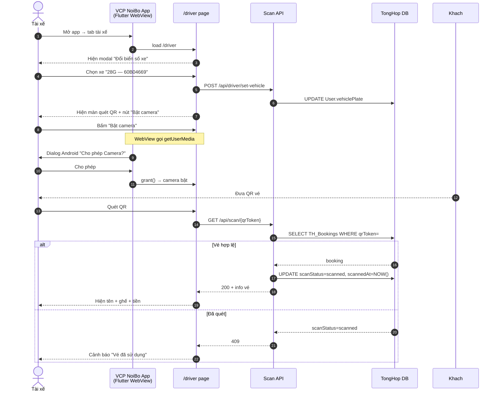
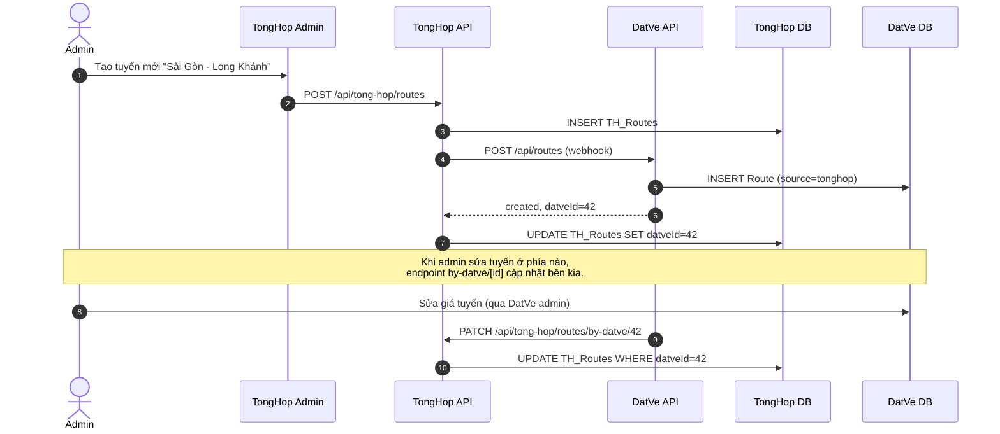
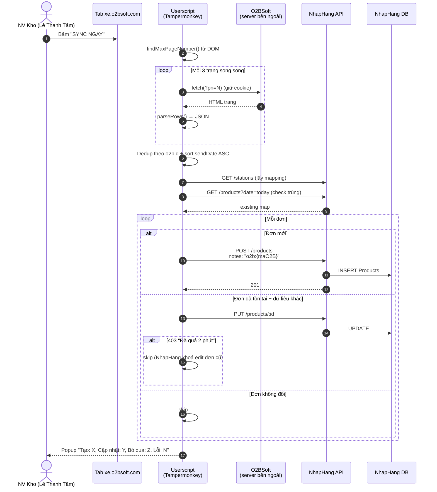
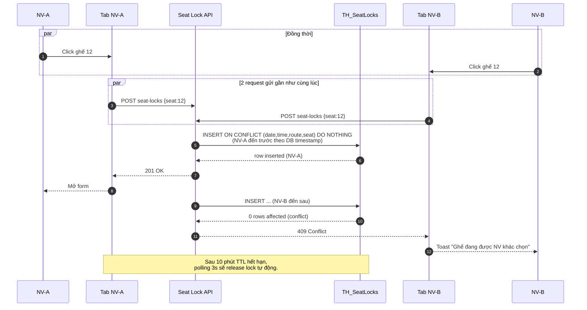

# Sequence Diagrams (RD — Realization Diagrams) — Các luồng chính

## 1. Khách đặt vé online

---

## 2. NV quầy tạo vé thủ công

---

## 3. Sync NhapHang "Dọc đường" → TongHop (luồng tự động)

---

## 4. Tài xế quét QR check-in

---

## 5. Đồng bộ Routes giữa TongHop ↔ DatVe (2 chiều)

---

## 6. O2BSoft → NhapHang sync (Tampermonkey userscript)

---

## 7. Khoá ghế tạm khi 2 NV cùng chọn 1 ghế (race condition)

